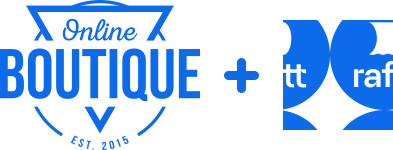

This project is used for Raftt's [connect-mode tutorial](https://docs.raftt.io/docs/basics/tutorials/connect_mode) that helps you onboard Raftt quickly, without using your code. In the tutorial you'll experience the basic usage of Raftt operating in connect mode - adding development capabilities to an existing env deployed to a Kubernetes namespace.

Online Boutique is a web-based e-commerce app where users can browse items, add them to the cart, and purchase them.
It is used as sample microservices application forked from Google's microservices [demo](https://github.com/GoogleCloudPlatform/microservices-demo). This project is  as a sample project to help you onboard Raftt quickly, without using your code.

This project is composed of 10 microservices written in different languages. Familiarity with these languages is **not required** to successfully complete the tutorial.

| Service                                              | Language      | Description                                                                                                                       |
| ---------------------------------------------------- | ------------- | --------------------------------------------------------------------------------------------------------------------------------- |
| [frontend](./src/frontend)                           | Go            | Exposes an HTTP server to serve the website. Does not require signup/login and generates session IDs for all users automatically. |
| [cart](./src/cartservice)                     | C#            | Stores the items in the user's shopping cart in Redis and retrieves it.                                                           |
| [productcatalog](./src/productcatalogservice) | Go            | Provides the list of products from a JSON file and ability to search products and get individual products.                        |
| [currency](./src/currencyservice)             | Node.js       | Converts one money amount to another currency. Uses real values fetched from European Central Bank. It's the highest QPS service. |
| [payment](./src/paymentservice)               | Node.js       | Charges the given credit card info (mock) with the given amount and returns a transaction ID.                                     |
| [shipping](./src/shippingservice)             | Go            | Gives shipping cost estimates based on the shopping cart. Ships items to the given address (mock)                                 |
| [email](./src/emailservice)                   | Python        | Sends users an order confirmation email (mock).                                                                                   |
| [checkout](./src/checkoutservice)             | Go            | Retrieves user cart, prepares order and orchestrates the payment, shipping and the email notification.                            |
| [recommendations](./src/recommendationservice) | Python        | Recommends other products based on what's given in the cart.                                                                      |
| [ads](./src/adservice)                         | Java          | Provides text ads based on given context words.

  

